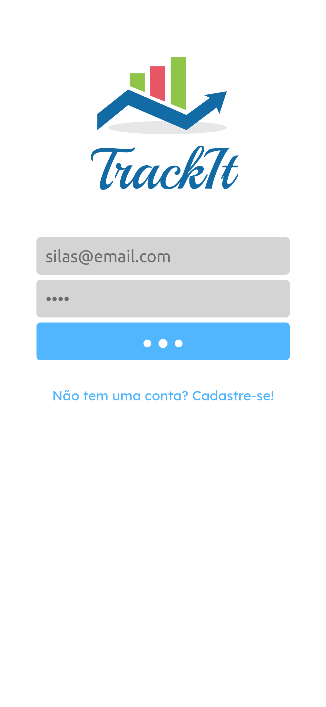

# TrackIt

This is a frontend project connected to a public API. This project was bootstrapped with [Create React App](https://github.com/facebook/create-react-app).

## Table of contents

- [Overview](#overview)
  - [Screenshot](#screenshot)
- [My process](#my-process)
  - [Built with](#built-with)
  - [What I learned](#what-i-learned)
  - [Continued development](#continued-development)
- [Author](#author)

## Overview

### Screenshot

## My process

### Built with

- React
- react-loader-spinner
- react-circular-progressbar
- dayjs
- Sass
- Styled Components
- Mobile-first workflow

### What I learned

This project was a challenge because of the many different libraries I had to add to it. I also challenged myself to use Sass alongside Styled Components to practice both styling methods. In a React project like this I believe Styled Components proved to be the better way to style the page.

### Continued development

In the future I will add a history tab using the react-calender lib.

## Author

- Website - [Silas Fernandes](https://github.com/SilasFr)
- Frontend Mentor - [@SilasFr](https://www.frontendmentor.io/profile/SilasFr)
- Twitter - [@SylarFN](https://twitter.com/SylarFN)
